# Automated Analysis Report

## Dataset Overview
- **Rows**: 10000
- **Columns**: 23
- **Missing Values**:
book_id                         0
goodreads_book_id               0
best_book_id                    0
work_id                         0
books_count                     0
isbn                          700
isbn13                        585
authors                         0
original_publication_year      21
original_title                585
title                           0
language_code                1084
average_rating                  0
ratings_count                   0
work_ratings_count              0
work_text_reviews_count         0
ratings_1                       0
ratings_2                       0
ratings_3                       0
ratings_4                       0
ratings_5                       0
image_url                       0
small_image_url                 0

## Key Insights
### Data Analysis Insights

1. **Overall Distribution of Ratings**:
   - The dataset contains a wide range of average ratings, with the lowest average rating around 3.57 (Twilight) and the highest at 4.44 (Harry Potter and the Philosopher's Stone). 
   - The average rating seems to correlate positively with the overall ratings count and the number of 5-star ratings, indicating that more popular books tend to have higher ratings.

2. **Author Popularity**:
   - Authors like Suzanne Collins and J.K. Rowling have produced highly rated books with substantial ratings counts. For instance, *The Hunger Games* has over 4.78 million ratings, highlighting its popularity.
   - Conversely, there might be authors with fewer high-rating books, indicating a disparity in recognition and readership that could denote "one-hit wonders" or authors yet to achieve broader recognition.

3. **Publication Year and Ratings**:
   - Older books such as *To Kill a Mockingbird* (1960) and *The Great Gatsby* (1925) have maintained high ratings, suggesting long-term appeal and reader investment, despite their original publication dates. 
   - Newer titles like *The Hunger Games* (2008) and *Twilight* (2005) likely benefit from contemporary culture and social media, driving their popularity.

4. **ISBN Data**:
   - The dataset contains missing values for the ISBN and ISBN13 fields. This could impact the ability to uniquely identify and locate books within databases, which may limit certain analytical capabilities (cross-referencing data, etc.).

5. **Language Codes and International Reach**:
   - There are notable missing values in the `language_code` column (1,084 entries), which might reflect a limitation in the dataset's capture of the international diversity of books. Books in non-English languages may not be adequately represented here, leading to skewed popularity metrics toward English-language works.

### Trends and Relationships

- **Ratings Counts vs. Average Ratings**:
  - There is a direct relationship where books with higher total ratings tend to score better on average. This could indicate that as more reviewers engage with a title, it tends to stabilize around a certain average rating. 

- **Impact of Book Count on Ratings**:
  - Books with more editions (higher `books_count`) do not always yield better average ratings. For instance, lower-rated books may have numerous editions that dilute the perceived quality. A regression analysis could uncover the strength of this correlation further.

- **Potential Outliers**:
  - Books with relatively high ratings counts but low average ratings (like *Twilight*) may represent outliers that could attract further investigation into community sentiment and feedback. Understanding the social media narrative around these titles may provide insights into their reception.

- **Rating Distribution Insights**:
  - The breakdown of ratings (ratings_1 to ratings_5) illustrates patterns in reader sentiment. For instance, books that receive a higher percentage of 5-star ratings compared to lower ratings suggest strong positivity, while those with uneven distributions may indicate polarized opinions.

In conclusion, this dataset presents rich opportunities for understanding book popularity, author impact, and reader sentiment across various dimensions. Further analysis using advanced statistical methods could unveil deeper patterns and relationships within the data.

## Visualizations
### Correlation Matrix
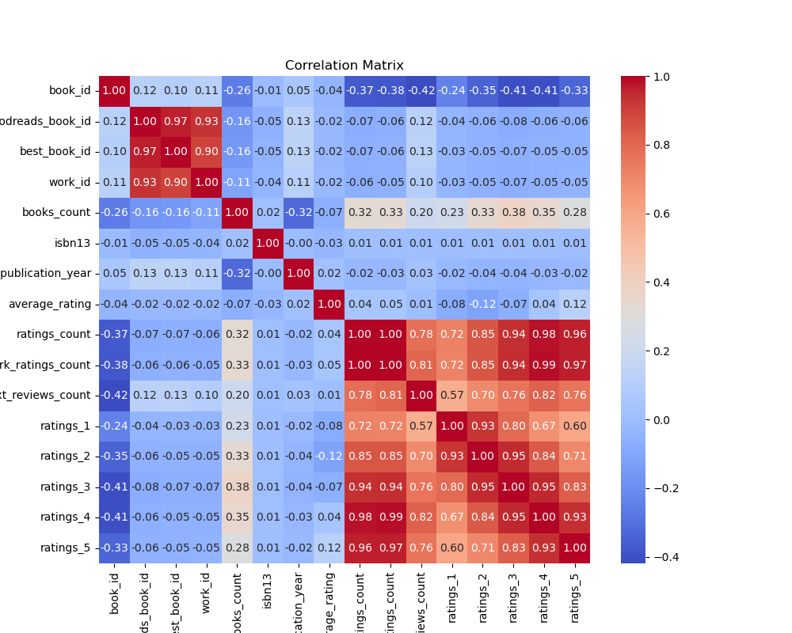

### Distributions
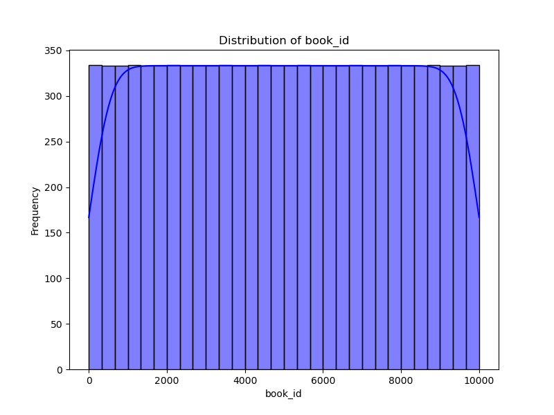
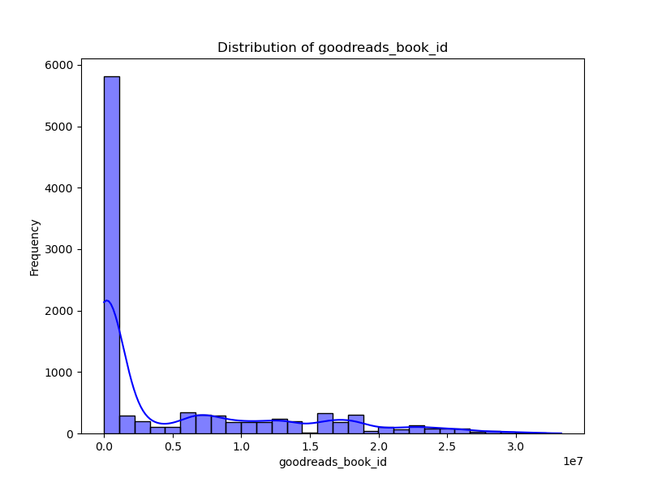
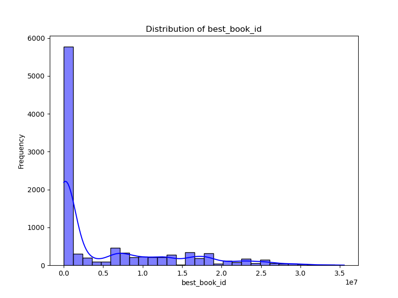
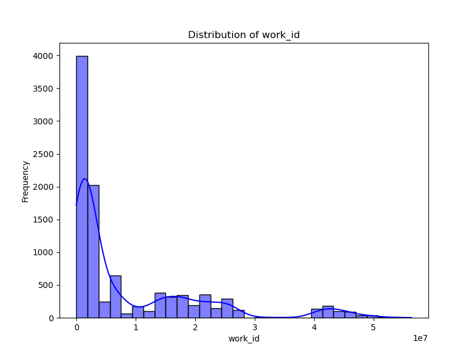
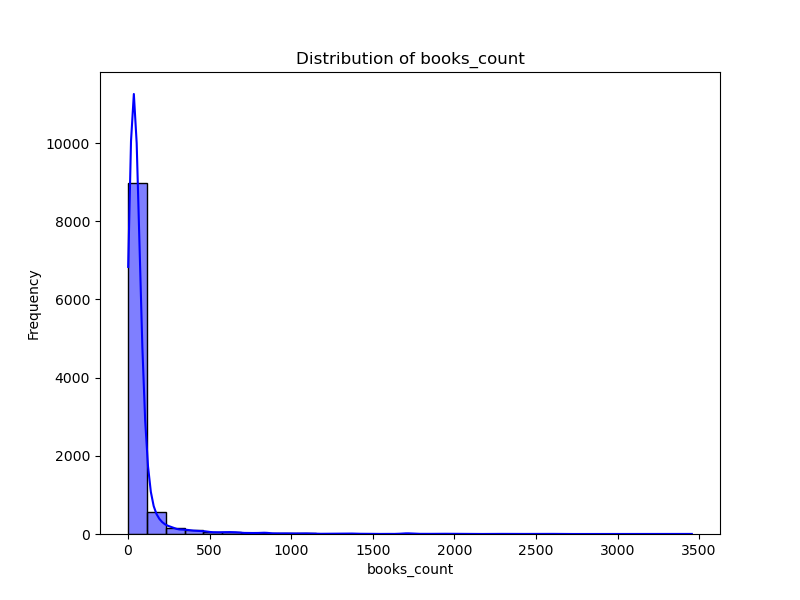
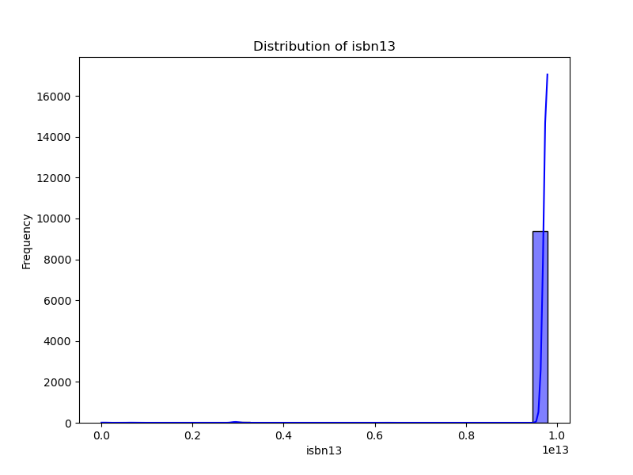
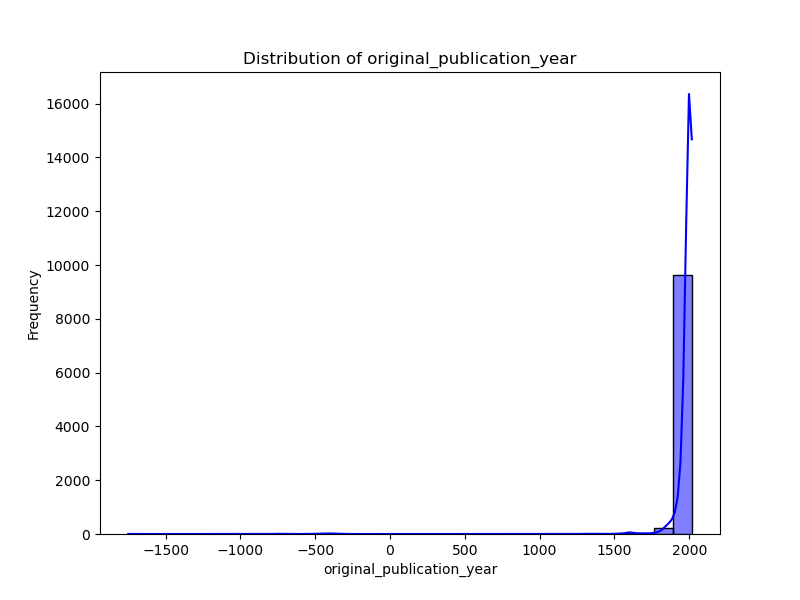
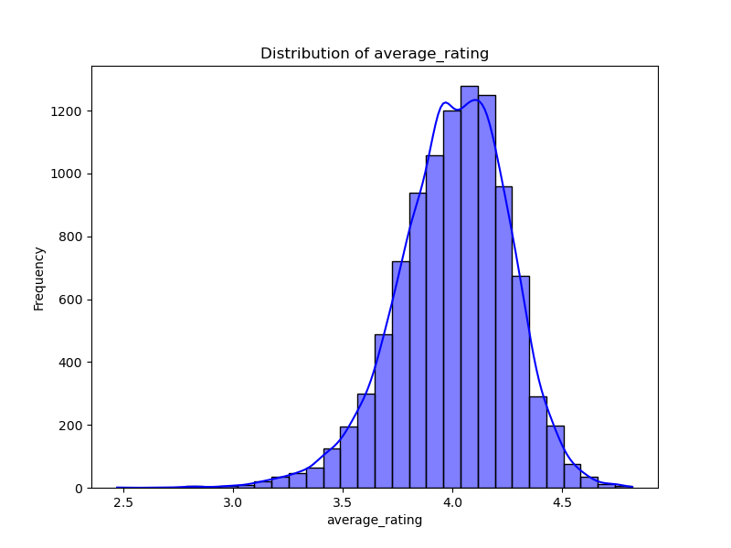
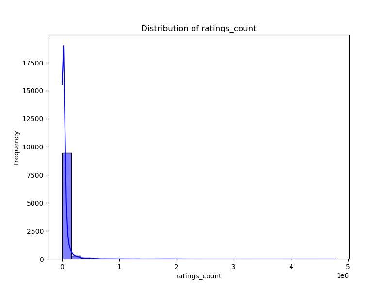
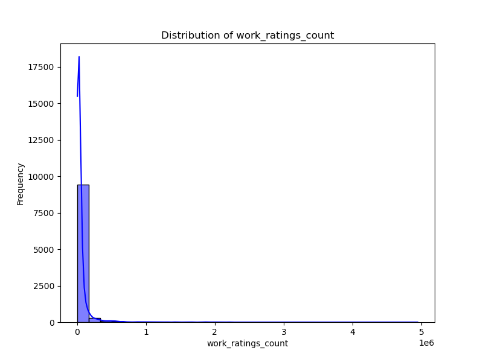
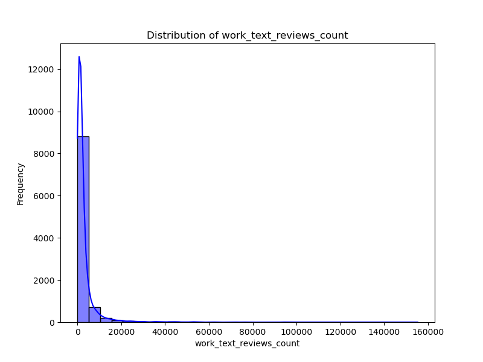
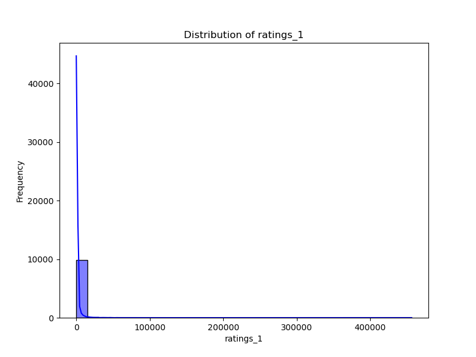
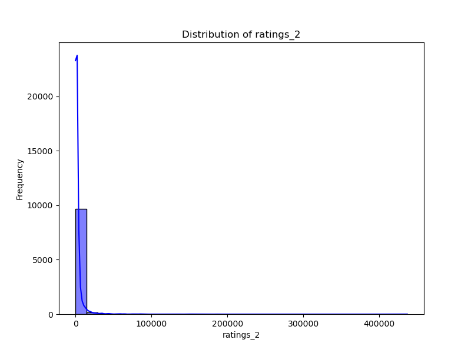
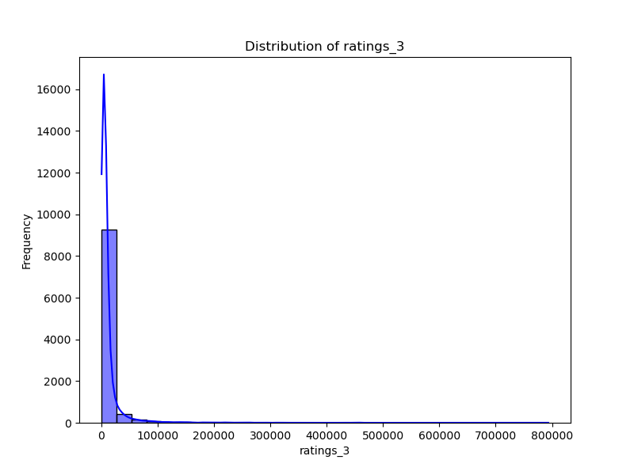
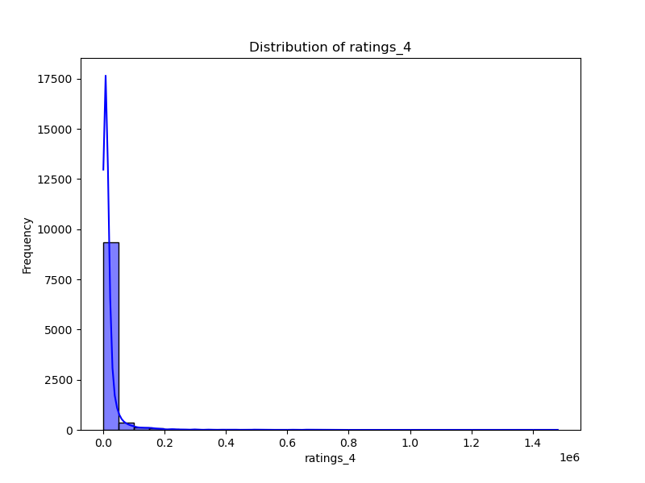
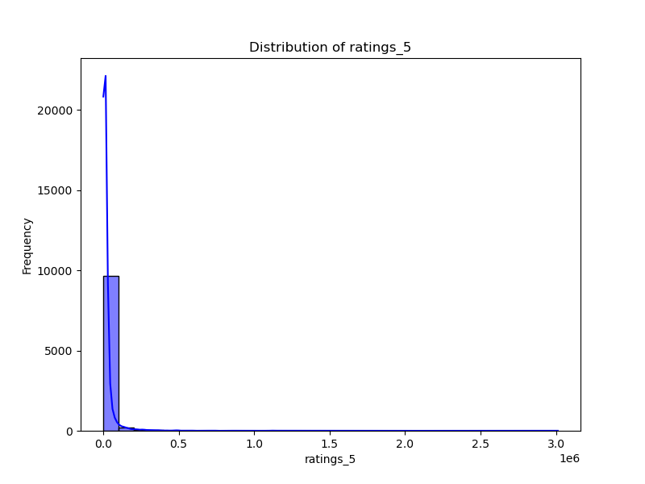
