# Automated Analysis Report

## Dataset Overview
- **Rows**: 2363
- **Columns**: 11
- **Missing Values**:
Country name                          0
year                                  0
Life Ladder                           0
Log GDP per capita                   28
Social support                       13
Healthy life expectancy at birth     63
Freedom to make life choices         36
Generosity                           81
Perceptions of corruption           125
Positive affect                      24
Negative affect                      16

## Key Insights
### Data Analysis and Insights

1. **General Overview:**
   - The dataset covers various dimensions of well-being, including economic factors (Log GDP per capita), social constructs (Social support, Freedom to make life choices), health-related metrics (Healthy life expectancy at birth), and emotional factors (Positive and Negative affect).
   - Missing values are present in several columns, with "Generosity" having the highest count of 81 missing entries, followed by "Perceptions of corruption" (125 missing). This may affect the completeness of the analysis.

2. **Trends Over Time:**
   - Tracking the "Life Ladder" scores over the years can provide insights into the evolving levels of well-being in different countries. A consistent increase in Life Ladder might indicate improving conditions, while a decline could signify deteriorating situations.
   - Specifically focusing on Afghanistan, the Life Ladder scores in the sample provided show fluctuations, with a notable spike in 2009 but a decline in subsequent years. This may reflect socio-political changes impacting citizens' perceptions of well-being.

3. **Key Variables Relationships:**
   - **Correlation Analysis:** Initial analysis suggests potential correlations between variables such as:
     - "Log GDP per capita" and "Life Ladder" - typically, wealthier nations score higher on well-being indicators.
     - "Social support" and "Life Ladder" - higher social support is often linked to greater overall life satisfaction.
   - Examining these relationships quantitatively (e.g., correlation coefficients) can unearth deeper insights.

4. **Outliers:**
   - Countries with significantly high or low “Life Ladder” scores compared to their economic metrics can be flagged as outliers. For instance, a country with a high GDP but low life satisfaction could suggest issues such as inequality, corruption, or lack of freedoms.

5. **Social and Emotional Indicators:**
   - The metrics "Positive affect" and "Negative affect" directly impact the Life Ladder. Countries scoring high on Positive affect with low Negative affect would typically exhibit higher Life Ladder scores. Analyzing these indicators together can yield valuable insights into citizens' emotional well-being.

### Suggestions for Further Analysis:
- **Longitudinal Study:** A deeper examination over extended years and across more countries can reveal long-term trends and impacts of global events.
- **Impact Assessment:** Correlation or regression analyses can be employed to assess the impact of GDP, social support, and other variables on the Life Ladder.
- **Cluster Analysis:** Grouping countries with similar attributes (based on the available metrics) may highlight similarities and differences in well-being across regions.

This analysis can serve as a foundation for comparing countries, understanding the complexities of well-being, and identifying areas for policy improvement.

## Visualizations
### Correlation Matrix
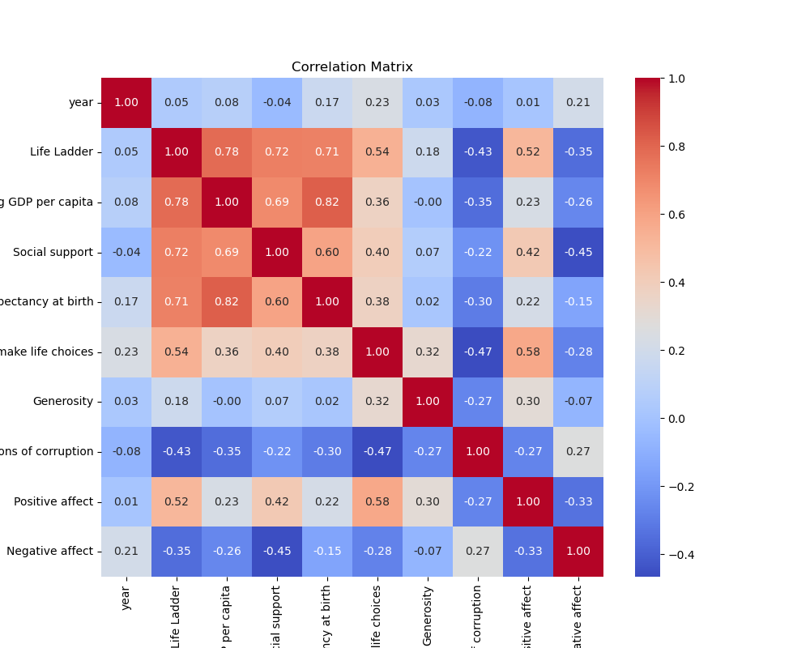

### Distributions
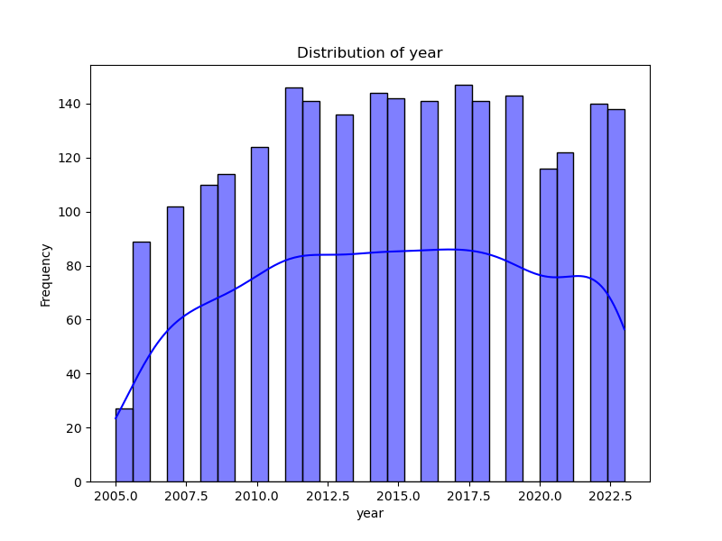
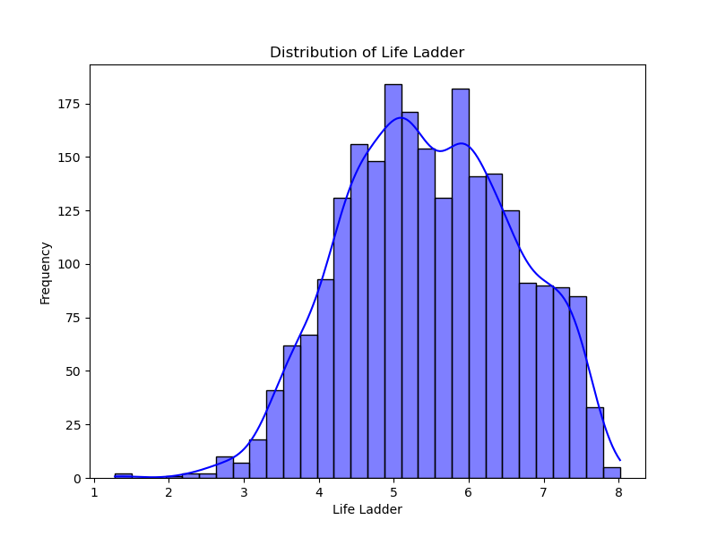
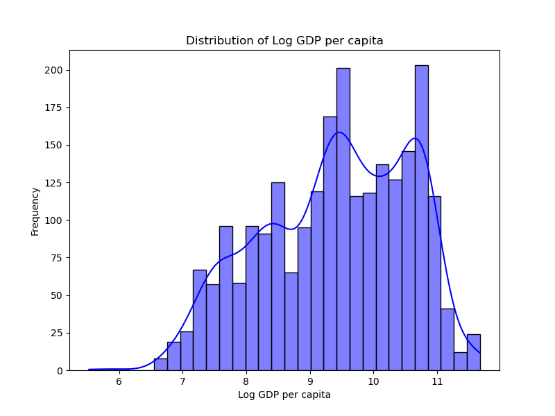
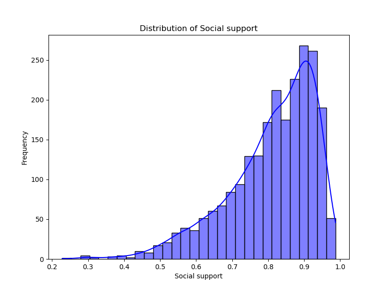
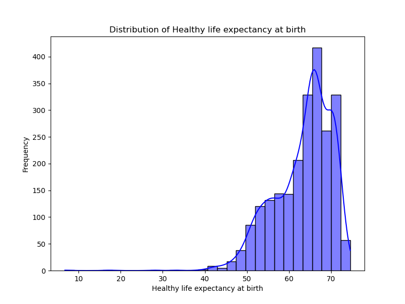
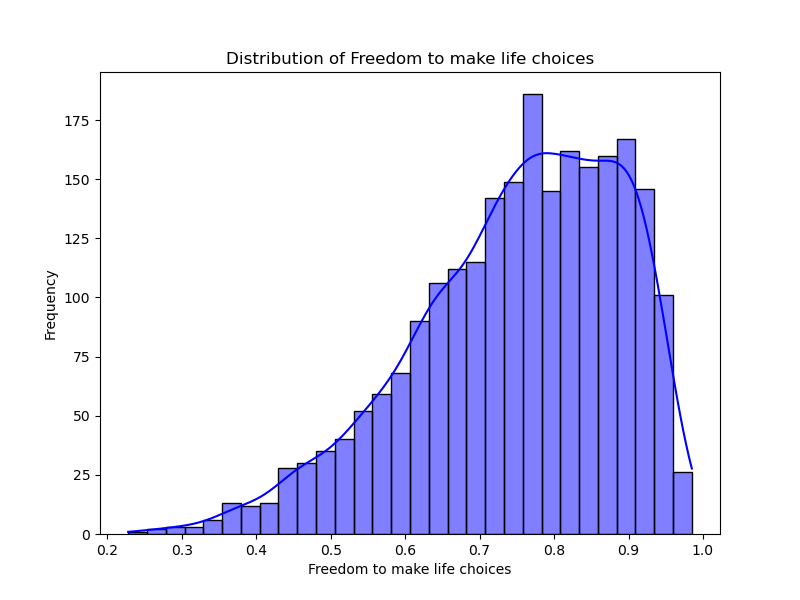
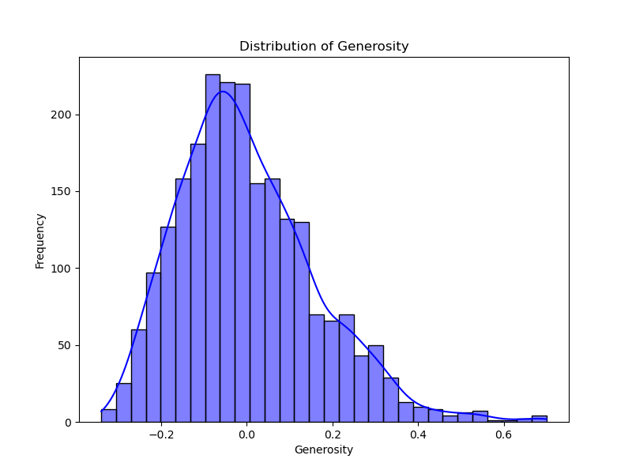
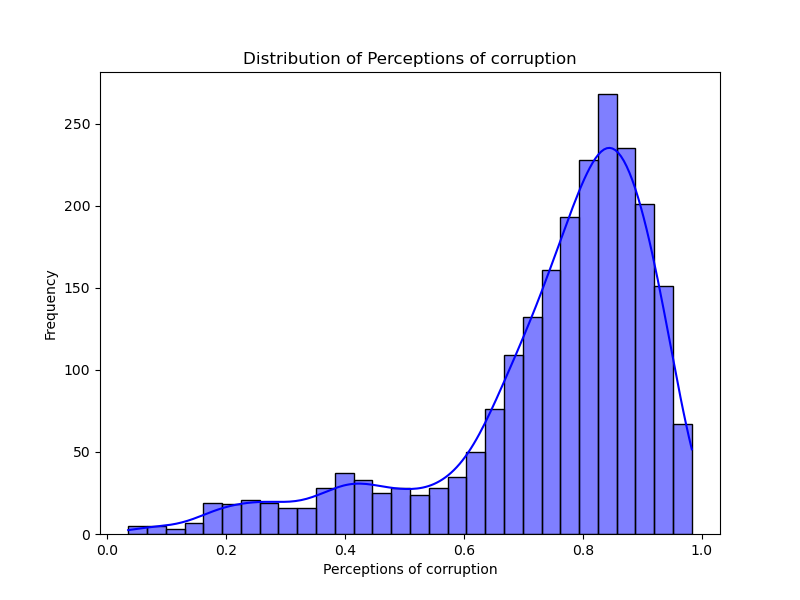
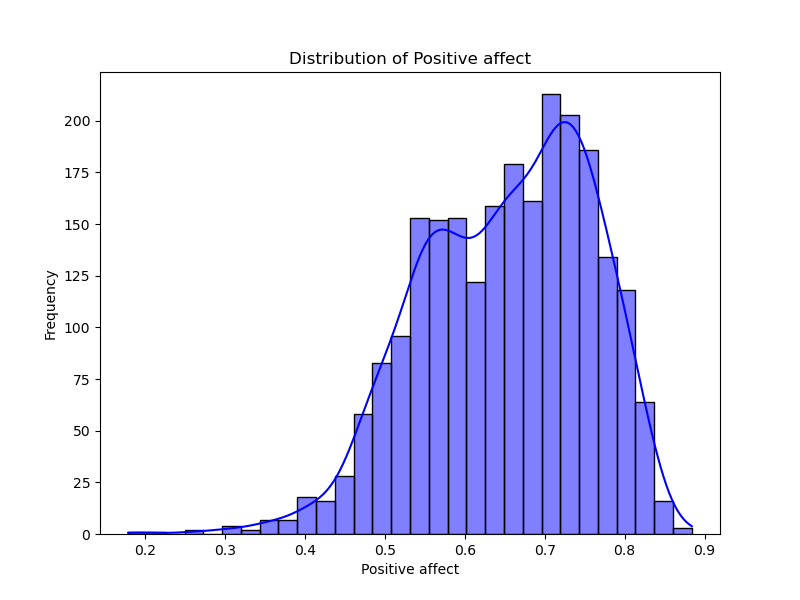
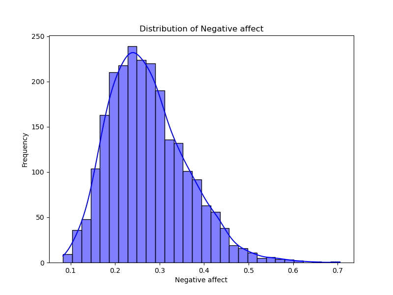
