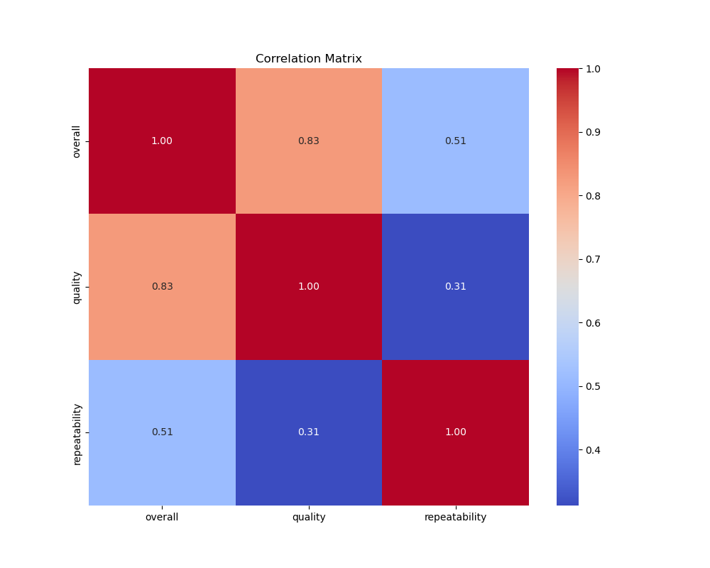
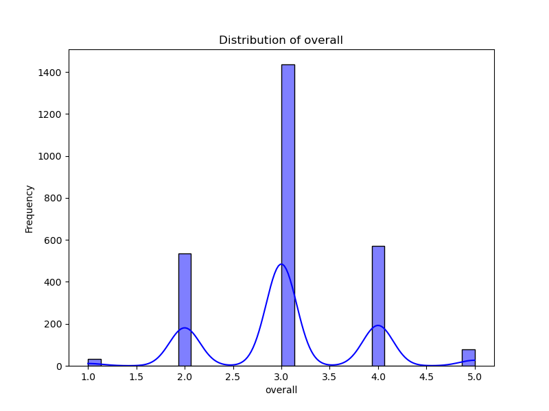
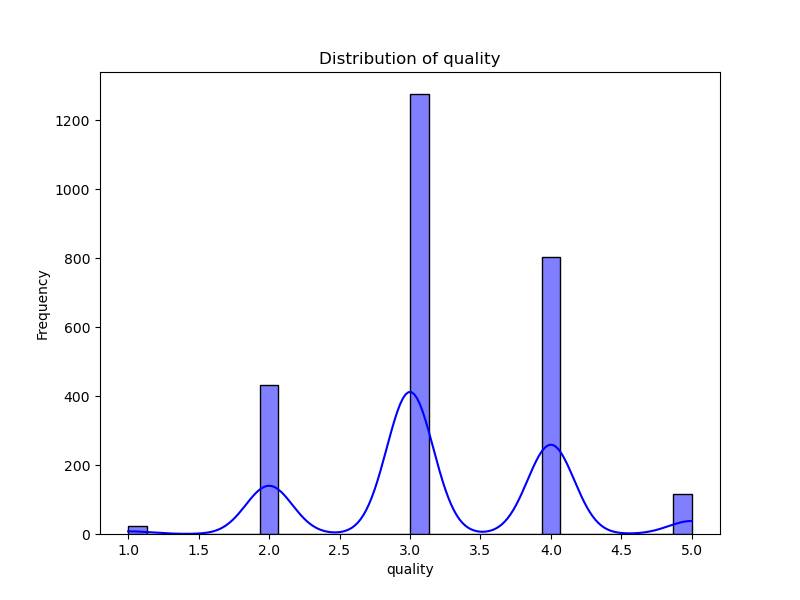
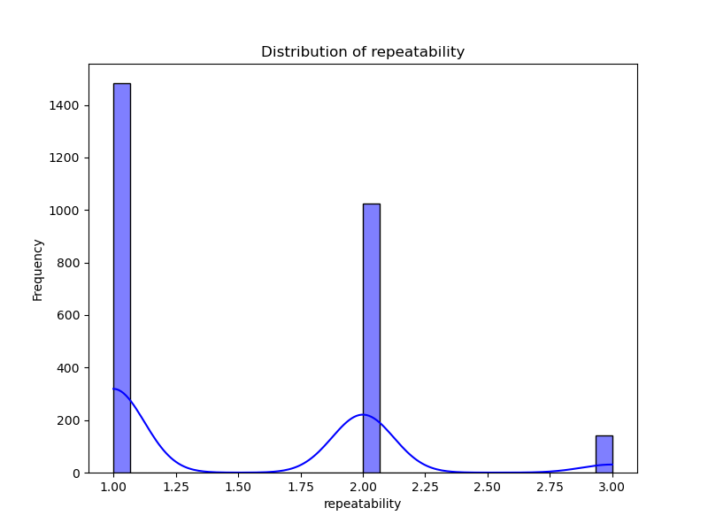

# Automated Analysis Report

## Dataset Overview
- **Rows**: 2652
- **Columns**: 8
- **Missing Values**:
date              99
language           0
type               0
title              0
by               262
overall            0
quality            0
repeatability      0

## Key Insights
### Data Analysis Insights

1. **Data Quality and Completeness**:
   - The dataset contains missing values in the **date** (99 entries) and **by** columns (262 entries). It’s crucial to address these gaps before conducting deeper analysis, especially since the **date** field is essential for time-sensitive insights.
   - Other columns including **language**, **type**, **title**, **overall**, **quality**, and **repeatability** are complete.

2. **Overall Ratings**:
   - The **overall** ratings range from 1 to 5, which allows for evaluating the audience's general perception of the movies.
   - Analyzing the mean and distribution of overall ratings can provide insights into movie performance within groups. 

3. **Language Breakdown**:
   - The sample indicates a focus on **Tamil** and **Telugu** movies. Assessing the distribution of reviews across languages could reveal preferences or trends in ratings.

4. **Quality Assessment**:
   - Similar to overall ratings, the **quality** ratings also span from 1 to 5. Comparing **quality** and **overall** ratings could indicate whether higher quality correlates with higher overall ratings.

5. **Repeatability**:
   - The repeatability scores consistently stand at 1 in the sample, suggesting that viewers might not find these movies worth rewatching, which could be a concern for engagement.

### Suggested Trends, Outliers, and Relationships

1. **Rating Correlation**:
   - Analyzing the correlation between **quality** and **overall** ratings can uncover whether audience perceptions of a movie’s quality align with their overall enjoyment. A positive correlation would be expected.

2. **Language Preference**:
   - Compare average ratings for different languages, looking for trends that might indicate a preference for one language over another. Additionally, examining whether different directors (as indicated in the **by** field) receive consistently higher or lower ratings can lead to insights about popular creators.

3. **Date Trends**:
   - Temporal analysis on the **date** column could reveal seasonal trends in ratings. For instance, are there specific months where ratings spike? This could correlate with holidays or festivals in relevant regions.

4. **Outlier Detection**:
   - Identify outliers in both **overall** and **quality** ratings. Movies with significantly lower ratings compared to their peers may be examined to understand contributing factors such as genre, cast, or even marketing strategies.

5. **Director Collaboration**:
   - Investigating the directors listed in the **by** field could highlight collaborations leading to better reviews, showcasing successful pairings worth exploring.

6. **Rating Distribution**:
   - Visualizing the distribution of ratings (e.g., histograms) can help in identifying clusters of popularity or common dissatisfaction points.

By exploring these insights and relationships, valuable patterns can emerge that drive strategic decisions in film production, marketing, and viewer engagement. Data cleaning for missing entries should be prioritized as the next step for analysis.

## Visualizations
### Correlation Matrix

### Distributions

